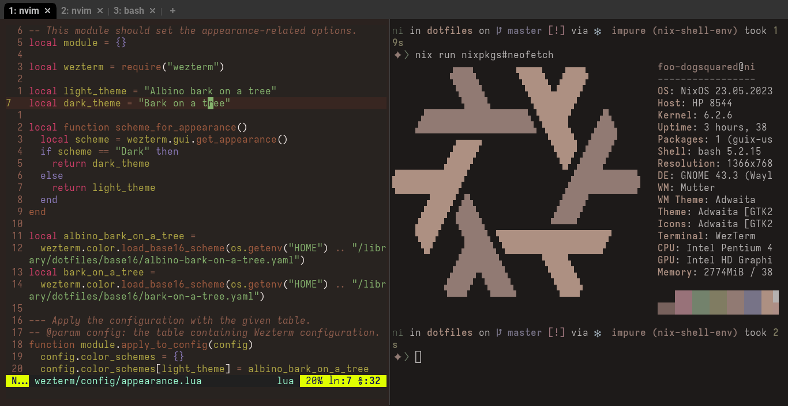

= Bark on a tree
:toc:

It's a link:https://github.com/chriskempson/base16/[base16 scheme] for a rustic autumn feel and look with the good ol' colors of the trees.
Inspired from link:https://www.nordtheme.com/[Nord].

// TODO: Add more pictures
.Wezterm and Neovim

